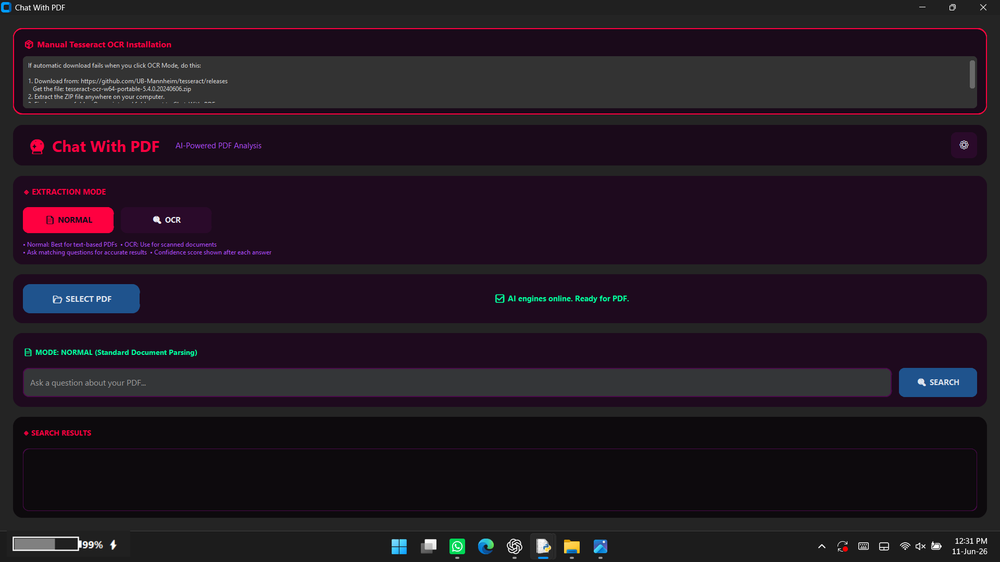

📚 CHAT WITH PDF - AI-POWERED DOCUMENT SEARCH
🎯 WHAT IS THIS?
This is a smart desktop application that lets you talk to your PDF documents. You can select any PDF file, ask questions in plain English, and the AI will find the most relevant answers from your document. It's like having a conversation with your PDFs.

🚀 KEY FEATURES
Ask Questions Naturally - Type any question about your PDF content

AI-Powered Search - Uses advanced machine learning to understand meaning

Two Extraction Modes - Normal mode for text PDFs, OCR mode for scanned documents

Confidence Scores - See how confident the AI is about each answer

Beautiful Interface - Modern dark-themed GUI with neon accents

Auto-Installer - Downloads all required packages automatically

OCR Support - Reads text from scanned images and photos

🛠️ HOW IT WORKS
The Technology Stack

This app uses three AI models working together:

Sentence Transformer - Understands the meaning of your questions

BM25 Algorithm - Finds keyword matches quickly

Cross-Encoder - Reranks results for maximum accuracy

Processing Pipeline

PDF File → Extract Text → Split into Chunks → Create Search Index → Answer Questions

💻 INSTALLATION GUIDE
Windows Users

Download the EXE file if available or run the Python script

First launch - The app automatically detects missing packages

Installer GUI appears - Shows progress for downloading customtkinter for modern UI, sentence-transformers for AI models, pypdf for PDF reading, and other dependencies

Mac and Linux Users

Install Python 3.8 or higher first, then run this command:

pip install customtkinter pypdf rank-bm25 sentence-transformers numpy pillow

For OCR support which is optional, run this command:

pip install pytesseract pdf2image

Manual Installation

The app includes an auto-installer. Just run the script and it handles everything with this command:

python chat_with_pdf.py

🎮 HOW TO USE
Step 1 - Select PDF

Click the SELECT PDF button and choose any PDF file from your computer

Step 2 - Choose Mode

Normal Mode is for text-based PDFs like digital documents and ebooks

OCR Mode is for scanned PDFs like photos of documents and old books

Step 3 - Ask Questions

Type your question in the search box and press Enter or click the SEARCH button

Step 4 - Get Answers

The app shows the most relevant text passage, a confidence percentage from 0 to 100 percent, and semantic match analysis

🎨 INTERFACE FEATURES
Main Window Components

The Header shows the app title and settings button

The Mode Card lets you toggle between Normal and OCR modes

The Document Card shows file selection and status

The Progress Bar shows loading status

The Search Area is where you type your questions

The Results Area displays AI answers

The Status Bar shows current operation

Visual Indicators

Green text means Success or Ready

Red accents mean Active mode or Important

Purple text means Information or Tips

Yellow text means Warnings or Processing

🧠 AI SEARCH EXPLANATION
How the Smart Search Works

First is Query Understanding which converts your question into mathematical vectors

Second is Dual Search Strategy which uses semantic search to understand meaning and keyword search to find exact terms

Third is Intelligent Reranking which uses Cross-Encoder to pick the best match

Fourth is Confidence Scoring which converts raw scores to percentage from 0 to 100 percent

Example Queries That Work Well

What are the main conclusions?

Summarize the methodology section

Find information about climate change

What does page 15 say about pricing?

List all recommendations

🔧 OCR SETUP FOR SCANNED PDFS
Automatic Method

Click the OCR MODE button and the app downloads Tesseract automatically which is about 40 MB

Manual Method If Auto Fails

First download from https://github.com/UB-Mannheim/tesseract/releases

Get the file named tesseract-ocr-w64-portable-5.4.0.20240606.zip

Extract the ZIP file anywhere on your computer

Copy the tesseract folder to your app's _internal folder

The final path must be _internal/tesseract/tesseract.exe

Restart the app and click OCR MODE

⚙️ CONFIGURATION
Settings File named pdf_app_settings.json

The settings file contains these options:

theme can be set to dark or light

accent_color sets the UI highlight color like #ff0040

ocr_mode sets OCR default state to true or false

font_family sets the interface font like Segoe UI

Environment Variables that are automatically set

TF_CPP_MIN_LOG_LEVEL equals 3 which hides TensorFlow warnings

HF_HUB_DISABLE_SYMLINKS_WARNING equals 1 which disables symlink warnings

TOKENIZERS_PARALLELISM equals false which prevents tokenizer conflicts

🐛 TROUBLESHOOTING
Common Issues and Solutions

If the app won't start, run as administrator and check that you have Python 3.8 or higher

If models won't download, check your internet connection, disable VPN, and try again

If OCR is not working, install Tesseract manually using the instructions above

If performance is slow, use smaller PDFs with less than 500 pages

If no answers are found, try different wording and enable OCR mode

If you get a memory error, close other apps and restart your computer

Error Messages Explained

No extractable text found means you should use OCR mode for scanned PDFs

Engine not ready means you need to load a PDF first before searching

Tesseract setup failed means manual OCR installation is needed

Installation failed means you should run as administrator and check your Python path

📊 PERFORMANCE TIPS
For Best Results

Keep PDFs under 500 pages as the maximum limit is 5000 pages

Ask specific questions rather than generic ones

Use OCR mode for old or scanned documents

Wait for full indexing before searching

The app works best with clear questions that match content in your PDF

Avoid asking vague questions like tell me everything as the AI needs specific queries

📦 REQUIRED PACKAGES
The app automatically installs these packages if missing:

customtkinter for the modern user interface

pypdf for reading PDF files

rank-bm25 for keyword search algorithm

sentence-transformers for AI understanding

numpy for mathematical operations

pillow for image processing

pytesseract for OCR text recognition

pdf2image for converting PDF pages to images

🔒 LIMITATIONS
The app can only process PDF files up to 5000 pages

Large PDFs may take longer to index

OCR mode works best with clear, high-quality scans

The AI models download about 150 MB of data on first run

Internet connection is required for first-time setup

The app requires Python 3.8 or higher to run

🎉 CONCLUSION
This Chat With PDF app transforms how you interact with documents. Instead of reading through hundreds of pages, you simply ask questions and get instant answers. The combination of keyword search and semantic understanding makes it powerful for research, studying, or any situation where you need to find information quickly in PDF documents.

The auto-installer handles all dependencies, the GUI is user-friendly, and the AI delivers accurate results with confidence scores. Whether you have text-based PDFs or scanned documents, this app has you covered with both normal and OCR extraction modes.

Enjoy chatting with your PDFs.
